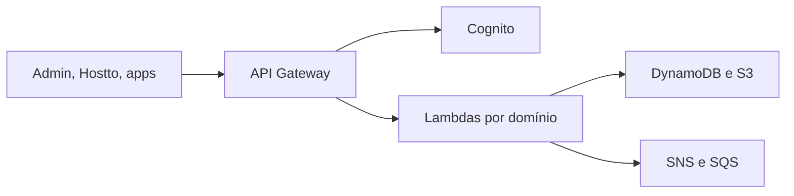

# airtestto

Backend serverless da plataforma. Organiza imóveis, pessoas, contratos, vendas, entregas e análises em domínios isolados, com uma API única na frente.

Este portal reúne a documentação que antes estava espalhada nos READMEs e nas pastas `docs/` dos repositórios. O texto foi reescrito como um único manual. O código de implementação continua nos repositórios privados.

## Por onde começar

| Se você quer | Vá para |
| --- | --- |
| Subir o backend localmente | [Setup do backend](setup/airtestto.md) |
| Entender o desenho | [Arquitetura](arquitetura/index.md) |
| Achar um domínio | [Mapa de domínios](dominios/index.md) |
| Consumir a API | [Convenções de API](api/index.md) |
| Ver uma interface | [Produtos](produtos/hostto.md) |

## Como o sistema se organiza

1. O cliente chama o API Gateway.
2. A rota protegida passa pelo authorizer do Cognito.
3. A integração chega na Lambda do domínio.
4. A Lambda lê e grava DynamoDB ou S3 e, quando o fluxo é assíncrono, publica em SNS ou SQS.

## O que este portal não publica

Procedimentos operacionais de retry, DLQ e replay, prompts de agente e planejamento financeiro pessoal ficam fora deste site.
