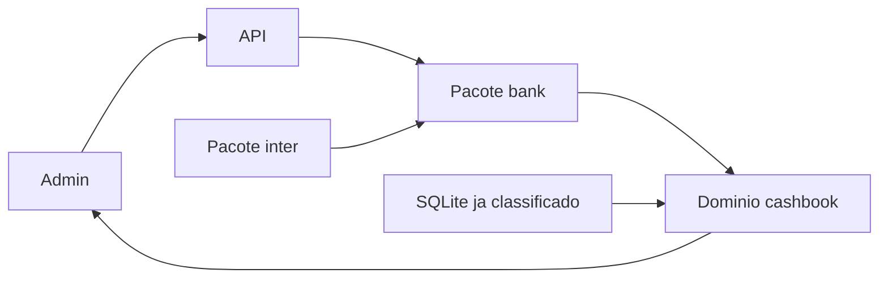

# Design: cashbook

**Status:** vigente
**Data:** 2026-09-27
**ADR:** [fase 1 do caixa](https://wmreis-labs.github.io/wmreis-docs/mudancas/adr/2026-09-27-fase-1-caixa/), [domínio cashbook](https://wmreis-labs.github.io/wmreis-docs/mudancas/adr/2026-09-27-dominio-cashbook/)
**PRD:** [caixa pessoal e profissional](https://wmreis-labs.github.io/wmreis-docs/mudancas/prd/2026-09-27-caixa-pessoal-profissional/)

## Objetivo

Receber a linha já normalizada, classificar com os tipos do importador e devolver o resultado do mês. O número é calculado no `cashbook`. A tela só exibe.

## Fora deste desenho

Telas, rota e estados do admin estão em [Admin](https://wmreis-labs.github.io/admin-docs/mudancas/design/2026-09-27-caixa-admin/). A leitura de OFX, CSV, PDF e do XLSX do cartão Itaú fica no `bank`. Open Finance, corretora e lançamento de imóvel não entram. `message` não lê caixa de e-mail. O Google Drive não é lido na fase 1.

## Fluxo

1. O upload chega na API e o `bank` lê o arquivo. A linha gravada tem data, valor, descrição e `fitid`. Em seguida o `bank` publica `TRANSACTIONS_CAPTURED`.
2. A conta Inter da TESTTO já publica esse evento na coleta que existe. A fase 1 configura a conta da WMREIS no mesmo conector, com outro `x-conta-corrente`. Nenhuma das duas entra por OFX.
3. O `cashbook` consome o evento, grava o movimento no livro da conta e classifica. A regra gravada, por ordem, ganha do classificador.
4. A carga do histórico copia o SQLite: a linha normalizada para o `bank` e o tipo já gravado para o `cashbook`. Esse arquivo cobre Milton e WMREIS, de 2024 a 2027. A TESTTO não está nele. O passado dela é o que o `inter` já deixou no `bank`, e o `cashbook` classifica essa coleta.
5. A API `/cashbook` devolve painel, revisão, lançamento manual, contas a vencer e plano de reserva.

## Livros e contas

Três livros: Milton, TESTTO e WMREIS. Cada conta tem banco e produto, `conta` ou `cartão`.

O movimento nasce no livro da conta. Conta sem livro vai para a revisão e não entra no resultado.

## Tipos

| Tipo | Efeito no resultado |
| --- | --- |
| `receita` | Receita real, se a categoria não estiver na revisão |
| `despesa` | Despesa real, se a categoria não estiver na revisão |
| `estorno` | Abate a despesa. No cartão, valor positivo da fatura |
| `interno` | Fora do resultado. Transferência dentro do mesmo livro |
| `retirada` | Fora do resultado. Transferência entre livros |
| `pagamento_fatura` | Fora do resultado. A compra já entrou no cartão |
| `investimento` | Fora do resultado |
| `patrimonial` | Fora do resultado |
| `emprestimo` | Fora do resultado |
| `ignorar` | Fora do resultado e da revisão |

No Santander não há fatura itemizada. O pagamento na conta corrente é `despesa`, não `pagamento_fatura`.

Estas categorias ficam na revisão e fora do resultado: "Pix para pessoas", "Outras entradas", "Sem categoria" e "Boleto sem favorecido".

## Contrato

O mês é o mês calendário de `data`, no formato `AAAA-MM`. Entram no agregado as linhas com situação `confirmado`, sem duplicata e com tipo diferente de `ignorar`.

Arquivo repetido: o `sha256` igual ao já gravado não é lido de novo. Linha repetida: a chave é conta, data, valor com duas casas, descrição normalizada nos primeiros 90 caracteres e `fitid`.

O painel, por livro e no consolidado, devolve receita real, despesa real, resultado e a série dos meses. Ao lado, sem entrar na conta: `interno`, `retirada`, `pagamento_fatura`, `investimento`, `patrimonial` e `emprestimo`. A tela não recalcula esses campos.

O lançamento manual grava conta, data, valor, descrição e um dos tipos. A data do manual é a mesma `data` do mês.

## Fases de dados

1. Três livros, conta e cartão, carga do SQLite, Inter da TESTTO e da WMREIS, upload lido no `bank`, classificação com revisão e o agregado do painel.
2. Pasta do Drive por banco e label do Gmail. O `bank` lê o arquivo da pasta como lê o upload. Previsto de boleto e conciliação com o extrato.
3. Meta de reserva, reserva atual, gap, aportes e sobra investível. A sobra é o resultado real depois de completar a reserva.

## Riscos

CSV instável por banco. O mapa de colunas fica na tarefa de arquivo, não neste corte. Pareamento que a regra não cobre vai para a revisão. A WMREIS ainda não está no header do Inter. Nenhum desses riscos autoriza gravar o caixa em `FinancialEntry`.
