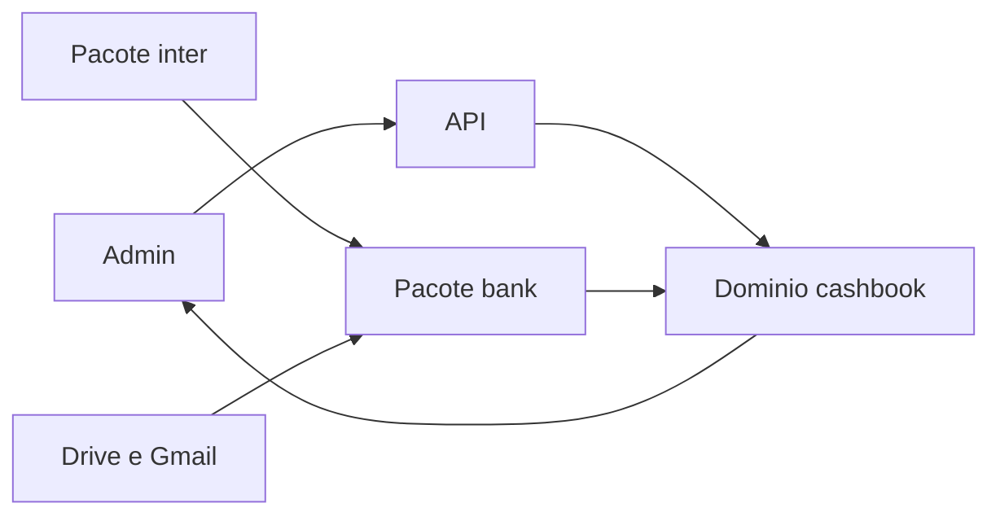

# Design: cashbook

**Status:** vigente
**Data:** 2026-09-27
**ADR:** [domínio cashbook](https://wmreis-labs.github.io/wmreis-docs/mudancas/adr/2026-09-27-dominio-cashbook/), [livros e naturezas](https://wmreis-labs.github.io/wmreis-docs/mudancas/adr/2026-09-27-livros-pf-pj/)
**PRD:** [caixa pessoal e profissional](https://wmreis-labs.github.io/wmreis-docs/mudancas/prd/2026-09-27-caixa-pessoal-profissional/)

## Objetivo

Receber extrato já normalizado, classificar cada movimento numa das quatro naturezas e devolver o resultado do mês. O número é calculado no backend. A tela só exibe.

## Fora deste desenho

Telas, rota e estados do admin estão em [Admin](https://wmreis-labs.github.io/admin-docs/mudancas/design/2026-09-27-caixa-admin/). Open Finance, corretora e lançamento de imóvel não entram. `message` não lê caixa de e-mail.

## Fluxo

1. Inter publica saldo e extrato detalhado na fila do `bank`, na coleta que já existe, ligado ao livro PJ.
2. Upload, pasta do Drive por banco e label de extrato no Gmail publicam o mesmo evento `TRANSACTIONS_CAPTURED`.
3. `bank` normaliza. `cashbook` lê o evento, grava o movimento no livro da conta e classifica.
4. A API `/cashbook` devolve painel, revisão, lançamento manual, contas a vencer e plano de reserva.

Conta antiga sem livro continua válida. O movimento fica sem livro e vai para a revisão até alguém escolher o livro.

## Classificação e pareamento

Cada movimento nasce no livro da conta. A natureza é uma destas:

| Natureza | Código | Efeito no resultado |
| --- | --- | --- |
| Externo | `EXTERNAL` | Receita ou despesa real |
| Entre contas do mesmo livro | `SAME_BOOK_TRANSFER` | Sai do resultado do livro |
| Entre livros | `CROSS_BOOK_TRANSFER` | Sai do livro e some no consolidado |
| Alocação | `ALLOCATION` | Fica fora do resultado do mês |

O pareamento usa valor, data próxima, contas próprias e texto (`PIX`, `TRANSFERENCIA`). Os dois lados da transferência entre livros ficam ligados. Se houver mais de um candidato, ou um PIX sem o outro lado, o item vai para a revisão. Confirmar uma vez grava uma regra pela descrição, para a próxima ocorrência não voltar à fila.

O resultado do livro e o consolidado são receita real menos despesa real. Transferência e alocação aparecem ao lado.

Alocação inclui aporte em corretora e o tipo `INVESTIMENTO` do Inter.

## Contrato de entrada

Três portas, um evento. A ordem de leitura do arquivo é OFX, depois CSV do banco. PDF não vira lançamento: entra na revisão com o arquivo anexado.

O CSV muda por banco. Cada banco de arquivo tem o seu mapa de colunas. OFX é o formato estável. Dois PIX iguais no mesmo dia podem casar errado; a revisão existe antes de confiar no número.

A segunda label do Gmail é só boleto e fatura. O que tiver valor e vencimento vira despesa prevista no livro da conta. Quando o extrato mostrar o pagamento, o previsto passa a conciliado. O que não der para ler fica na revisão. O que não casar continua na lista de contas a vencer.

Lançamento manual aceita receita, despesa, transferência ou aporte, com data de competência.

## Dados

`cashbook` tem tabela própria. Extrato é dado sensível: fica no tenant, em DynamoDB e S3, sem logar linha de extrato. O critério de log é o ADR de logs e PII.

A leitura automática do Google só roda com credencial no ambiente da API. Sem essa credencial, a porta oficial é o upload.

## Fases de dados

1. Livros, upload OFX/CSV, Inter no livro PJ, classificação com revisão e o agregado do painel.
2. Drive e Gmail por label. Previsto de boleto e conciliação com o extrato.
3. Meta de reserva, reserva atual, gap, aportes e sobra investível. A sobra é o resultado real depois de completar a reserva.

## Riscos

CSV instável por banco. Pareamento ambíguo de PIX. Credencial do Google ausente até a fase 2. Nenhum desses riscos autoriza gravar o caixa em `FinancialEntry`.
